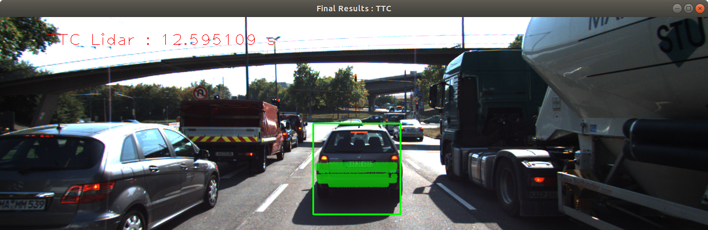
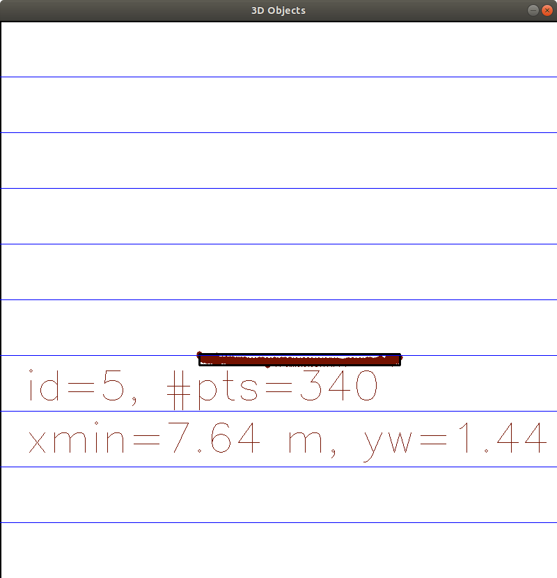
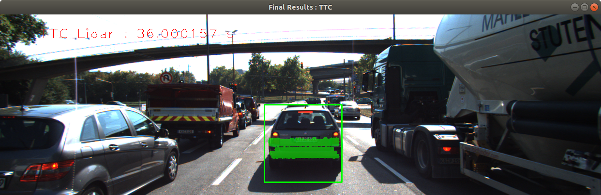
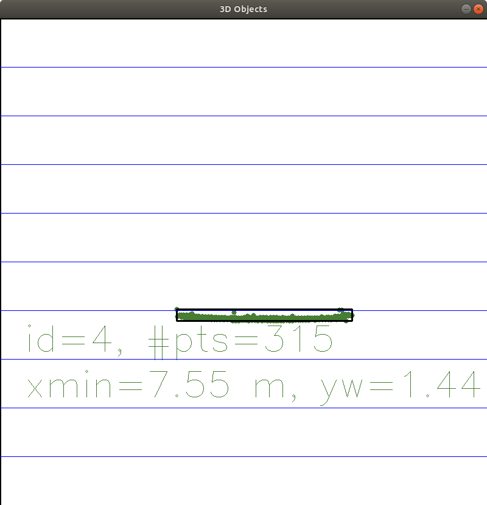
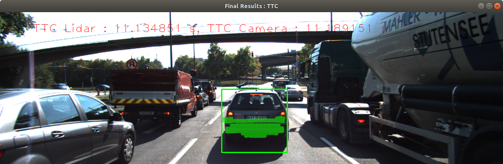
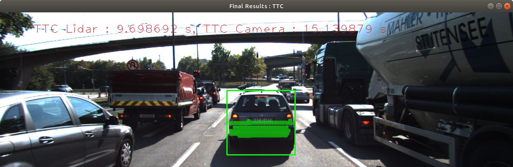
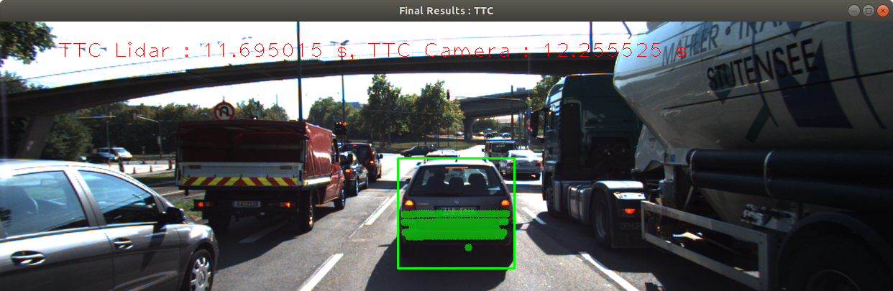

# 3D Object Tracking

This project is largely inspired by the Udactiy Sensor Fusion Nanodegree course project (see https://github.com/udacity/SFND_3D_Object_Tracking). It is used as a solution project submission for the 3D Object Tracking module of the mentioned course.

The executable that is implemented in this project calculates the Time-to-Collision (TTC) to a preceding car based on both camera and 3D lidar data.

The software was tested on Ubuntu 18.04.


## Usage Instructions

### Install Dependencies

The following guide was used to install OpenCV (4.3) on Ubuntu 18.04:

* https://linuxize.com/post/how-to-install-opencv-on-ubuntu-18-04/

Various other tutorials can be found on the internet for installing OpenCV on other operating systems.

Additional dependecies are cmake (>= 2.8), make (>= 4.1) and gcc/g++ (>= 5.4).


### Build the Project

```
git clone https://github.com/sebdengler/3D-object-tracking.git
cd 3d-object-tracking
mkdir build && cd build
cmake ..
make
```

### Run the Executable

```
./3D_object_tracking
```

## Analysis

### TTC with Lidar

For a better rubustnes against outliers not the closest lidar points to the ego vehicle for used for TTC calculation but the third closest.

When evaluating the TTC based on the Lidar data, only one major implausibility could be observed. After a TTC of 12.60s was calculated for in the second frame, a TTC of 36.00s was calculated in the third frame. The reason can be seen in Figure 1 and Figure 2. The lidar data that was gathered in the two frames does not show significant differences in direction towards the ego vehicle. As a result, the TTC is very high.



_Figure 1, Frame 2_



_Figure 2, Frame 3_


### TTC with Camera

In the previous project an initial evaluation of detector/descriptor combinations was made (see https://github.com/sebdengler/2D-feature-tracking.git). The top three choices from this evaluation where taken for a deeper analysis with regard to their TTC calculation results.

Compared to the lidar based TTC estimation, the camera based TTC estimation was less stable with a larger set of outliers. As an example see Figures 3, 4 and 5 where the TTC jumped to a high value for one frame and returned to one that was similar to the lidar based TTC value for the next frame.



_Figure 3, Frame 6 (BRISK/BRIEF)_



_Figure 3, Frame 7 (BRISK/BRIEF)_



_Figure 3, Frame 8 (BRISK/BRIEF)_

Out of the 3 combinationes (FAST/BRIEF, BRISK/BRIEF, BRISK/BRISK), the combination BRISK/BRISK resulted in the most stable TTC results, that were mostly similar to the results from the lidar data.